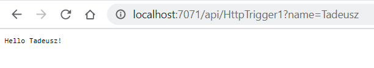

# Tutorial: Create and deploy serverless Azure Functions in Python with Visual Studio Code #

## 1. Configure your enviroment
   
   1) Tutorial: https://docs.microsoft.com/en-us/azure/developer/python/tutorial-vs-code-serverless-python-01
   2) Node.js https://nodejs.org/en/download/

### Problems and solutions: ###

1) func command isn't recognized

  run ```npm install -g azure-functions-core-tools@3``` again and verify that the install succeeds.

2) running scripts is disabled on this system

```
PS C:\Users\PanKomputer> func
func : File C:\Users\PanKomputer\AppData\Roaming\npm\func.ps1 cannot be loaded because running scripts is disabled on this
135170.
At line:1 char:1
+ func
+ ~~~~
    + CategoryInfo          : SecurityError: (:) [], PSSecurityException
    + FullyQualifiedErrorId : UnauthorizedAccess
```

Solution: https://stackoverflow.com/questions/57673913/vsc-powershell-after-npm-updating-packages-ps1-cannot-be-loaded-because-runnin

    1) search for powershell
    2) right click and run as administration
    3) run this simple command Set-ExecutionPolicy RemoteSigned
    4) Press A And Enter

```

## Check configuration:

PS C:\Users\PanKomputer> func

                  %%%%%%
                 %%%%%%
            @   %%%%%%    @
          @@   %%%%%%      @@
       @@@    %%%%%%%%%%%    @@@
     @@      %%%%%%%%%%        @@
       @@         %%%%       @@
         @@      %%%       @@
           @@    %%      @@
                %%
                %


Azure Functions Core Tools
Core Tools Version:       3.0.3160 Commit hash: 00aa7f43cc5c5f15241b5e6e5363256f19ceb990
Function Runtime Version: 3.0.14916.0
```

## 2. Create the Python function and examine code files
    
    Turorial: https://docs.microsoft.com/en-us/azure/developer/python/tutorial-vs-code-serverless-python-02
      

### function.json

```
{
  "scriptFile": "__init__.py",
  "bindings": [
    {
      "authLevel": "anonymous",
      "type": "httpTrigger",
      "direction": "in",
      "name": "req",
      "methods": [
        "get",
        "post"
      ]
    },
    {
      "type": "http",
      "direction": "out",
      "name": "$return"
    }
  ]
}
```
Description: 

* "scriptFile:" - the startup file for the code
* "bindings:" element:

    *  Incoming requests ("direction": "in") -  the function responds to HTTP GET or POST requests
    *  The response ("direction": "out") is an HTTP response that returns whatever value is returned from the main Python function.
  
```

## __init__.py
import logging

import azure.functions as func


def main(req: func.HttpRequest) -> func.HttpResponse:
    logging.info('Python HTTP trigger function processed a request.')

    name = req.params.get('name')
    if not name:
        try:
            req_body = req.get_json()
        except ValueError:
            pass
        else:
            name = req_body.get('name')

    if name:
        return func.HttpResponse(f"Hello, {name}. This HTTP triggered function executed successfully.")
    else:
        return func.HttpResponse(
             "This HTTP triggered function executed successfully. Pass a name in the query string or in the request body for a personalized response.",
             status_code=200
        )
```
Requirements:

  * import azure.functions 
  * import Logging (optional/recommended)
  
The body of main processes the request and generates a response. The code returns the string "Hello" with the name appended and a notice of function success or returns an generic message.

```
Functions:

        HttpExample: [GET,POST] http://localhost:7071/api/HttpExample
```  
### http://localhost:7071/api/HttpExample

```
   This HTTP triggered function executed successfully. Pass a name in the query string or in the request body for a personalized response.
```
  

### Deploy Azure Functions in Python


```
07:43:16 WojtekFirstFunction: HTTP Trigger Urls:
  HttpExample: https://wojtekfirstfunction.azurewebsites.net/api/HttpExample
```


## 3. Connect Azure Functions to Azure Storage using Visual Studio Code

    1) Install the Azure Storage extension for Visual Studio Code.
    2) Install Azure Storage Explorer
    3) Azure Functions: Download Remote Settings....
    4) Adding binding...
    5) Examine the output (Azure Storage: Open in Storage Explorer)


https://docs.microsoft.com/en-us/azure/azure-functions/functions-add-output-binding-storage-queue-vs-code?pivots=programming-language-python

```
import logging

import azure.functions as func


def main(req: func.HttpRequest, msg: func.Out[func.QueueMessage]) -> str:

    name = req.params.get('name')
    if not name:
        try:
            req_body = req.get_json()
        except ValueError:
            pass
        else:
            name = req_body.get('name')

    if name:
        msg.set(name)
        return func.HttpResponse(f"Hello {name}!")
    else:
        return func.HttpResponse(
            "Please pass a name on the query string or in the request body",
            status_code=400
        )
```



